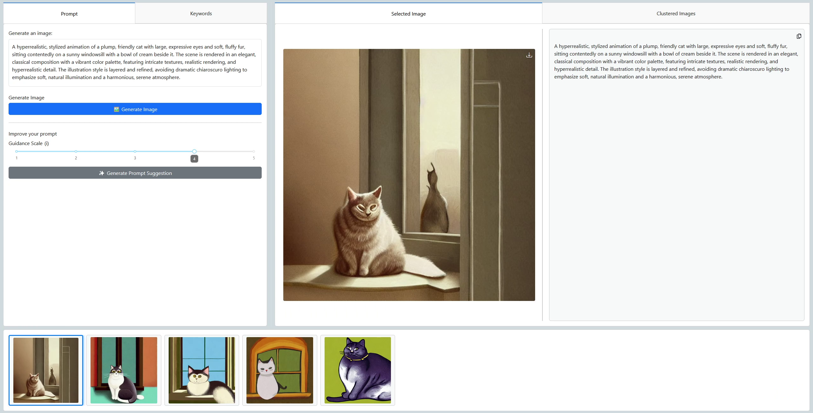

# ImPRESS: Iterative Prompt Refinement through Semantic Slider Feedback and Foundation Model Guidance  
### Multimedia Analytics Group 9



**ImPRESS** is an interactive dashboard for analyzing and refining AI-generated prompts using semantic sliders and multimodal feedback. It supports experimentation with foundation models in a visually guided interface.

---

## Installation

Clone the repository:

```bash
git clone https://github.com/Mathijsvs03/Multimedia-Analytics.git
cd Multimedia-Analytics
```

### Using venv

```bash
python -m venv .venv
source .venv/bin/activate       # On Windows: .venv\Scripts\activate
pip install -r requirements.txt
```

### Using conda

```bash
conda create -n <your_env_name> python=3.10
conda activate <your_env_name>
pip install -r requirements.txt
```

---

## Run ImPRESS Locally

```bash
python -m src.app
```

Access the app at [http://127.0.0.1:8050/](http://127.0.0.1:8050/)

---

## Running on Snellius

See `snellius/notes.txt` for Snellius-specific instructions.

---

## Project Structure

```
Multimedia-Analytics/
├── src/
│ ├── assets/         # Stylesheets (CSS)
│ ├── callbacks/      # Callback logic
│ ├── dataloaders/    # Dataset loading utilities
│ ├── widgets/        # Dashboard UI components
│ ├── app.py          # Main Dash app entry point
│ ├── Dataset.py      # Dataset class definition
│ ├── llm_utils.py    # Utilities for LLM interaction
│ ├── utils.py        # General utility functions
│ └── config.py       # Configuration settings
├── images/           # Teaser image
├── snellius/         # Snellius-specific instructions and scripts
├── .gitignore        # Git ignore rules
├── requirements.txt  # Python dependencies
└── README.md         # Project documentation
```

---
